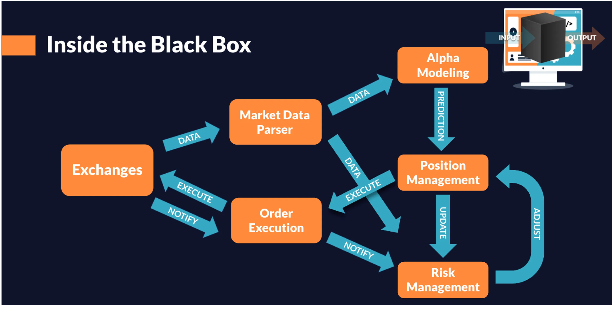

# Crypto Trading

### 0x00 Trading Infrastructures

1. [DEX](https://chain.link/education-hub/what-is-decentralized-exchange-dex): [AMM](https://chain.link/education-hub/what-is-an-automated-market-maker-amm) based (e.g. [Uniswap](https://app.uniswap.org/)), [Order Book](https://www.coinbase.com/de/learn/advanced-trading/what-is-an-order-book) based (e.g. [0x](https://0x.org/), [dYdX](https://dydx.exchange/))
2. [CEX](https://coinmarketcap.com/rankings/exchanges/): [Order Book](https://www.coinbase.com/de/learn/advanced-trading/what-is-an-order-book) based (e.g. [Binance](https://www.binance.com/en/activity/referral-entry/CPA/together?ref=CPA\_00BR3HW76G), [Coinbase](https://www.coinbase.com/))

### 0x01 Process in Quantitative Trading (e.g. Kronos)

1. Parsing Market Data
2. Alpha Modeling
3. Position Management
4. Order Execution
5. Risk Management

<figure><figcaption>
Process in Quantitative Trading (e.g. Kronos)
</figcaption></figure>

### 0x02 扩展阅读

1. [What’s the Difference Between a CEX and a DEX?](https://academy.binance.com/en/articles/what-s-the-difference-between-a-cex-and-a-dex)
2. [A beginner’s guide to cryptocurrency trading strategies](https://cointelegraph.com/learn/a-beginners-guide-to-cryptocurrency-trading-strategies)
3. [Kronos Research如何做到世界級的成績？](https://medium.com/kronosresearch/kronos-research%E5%A6%82%E4%BD%95%E5%81%9A%E5%88%B0%E4%B8%96%E7%95%8C%E7%B4%9A%E7%9A%84%E6%88%90%E7%B8%BE-da079364369b)
